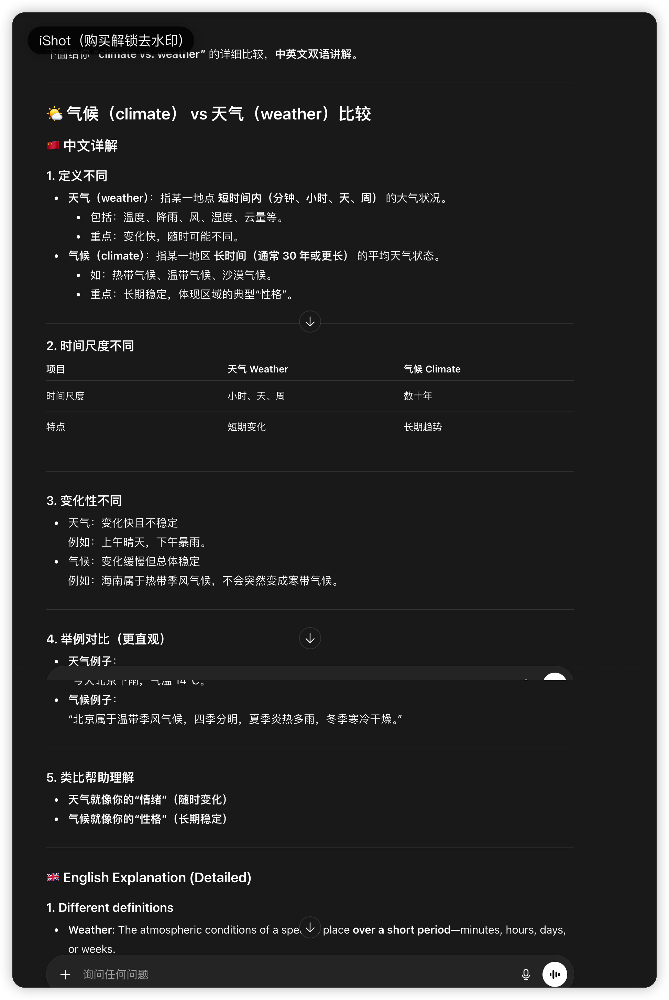

Climate vs Weather 深度对比解析
Climate 和 Weather 是气象学中核心且易混淆的概念，二者的本质区别在于时间尺度、空间范围和稳定性—— 简单来说：Weather 是 “当下的天气状况”，Climate 是 “长期的气候规律”。以下从多维度展开对比，结合定义、特征、示例等，帮你精准区分和使用。
一、核心定义与本质差异
1. Weather（天气）
中文定义：指某一地区短时间内（几分钟到几天）大气的具体状态，是大气活动的 “瞬时快照”。
英文定义：The state of the atmosphere at a specific time and place，including temperature, humidity, precipitation, wind speed, cloud cover, etc.
本质：短期、局部、多变的大气现象，受即时气流、水汽等因素影响。
2. Climate（气候）
中文定义：指某一地区长期内（通常 30 年以上）天气状况的平均状态及变化规律，是天气的 “长期统计结果”。
英文定义：The average and variability of weather conditions over a long period of time (typically 30 years or more) for a given region.
本质：长期、大范围、稳定的气候特征，由纬度、海陆位置、地形、洋流等长期因素决定。
二、关键维度对比表
对比维度	Weather（天气）	Climate（气候）
时间尺度	短期（分钟、小时、天、最多几周）	长期（30 年以上，联合国气象组织 WMO 标准）
空间范围	局部（如城市、街区、小区域）	大范围（如国家、大洲、气候带，如热带、温带）
核心特征	多变、不稳定、瞬时性	稳定、有规律、平均性
描述对象	具体气象要素（温度、降雨、风速、云量、雷暴等）	气候要素的统计值（平均气温、年降水量、降水季节分布、极端天气频率等）
影响因素	短期大气运动（如锋面、气旋、对流）	长期地理因素（纬度、海陆分布、地形、洋流、大气环流）+ 人类活动（如温室气体排放）
常用描述词	晴、雨、雪、风、热、冷、雷阵雨、雾霾（具体状态）	温暖、干燥、湿润、寒冷、季风性、大陆性（整体特征）
预测 / 研究领域	天气预报（meteorology 气象学）	气候预测、气候变化（climatology 气候学）
三、典型示例（中英对照）
1. Weather 示例（描述短期具体状况）
中文：“今天北京下暴雨，阵风 8 级，气温 18-25℃。”
英文："Beijing is having heavy rain today with gusts up to 8 on the Beaufort scale, and the temperature is between 18-25℃."
中文：“明天上海会转晴，午后有轻微雾霾。”
英文："Shanghai will turn sunny tomorrow with slight smog in the afternoon."
中文：“昨晚突发雷暴，导致部分地区停电。”
英文："A sudden thunderstorm last night caused power outages in some areas."
2. Climate 示例（描述长期规律特征）
中文：“广州的气候湿热，夏季漫长多雨，冬季温暖短暂。”
英文："Guangzhou has a hot and humid climate with long, rainy summers and short, warm winters."
中文：“北极地区气候严寒，年平均气温低于 - 10℃，降水以雪为主。”
英文："The Arctic region has an extremely cold climate, with an average annual temperature below -10℃ and precipitation mainly in the form of snow."
中文：“过去 50 年，全球气候变暖导致极端高温天气频率增加。”
英文："Over the past 50 years, global climate change has led to an increase in the frequency of extreme high-temperature weather."
四、易混淆点与实用辨析技巧
1. 核心区分口诀
短期局部看 “天气”（Weather）：关注 “当下 / 近期” 的具体状态；
长期大范围看 “气候”（Climate）：关注 “多年平均” 的规律特征。
2. 常见搭配误区纠正
正确搭配	错误搭配	原因解析
bad weather（坏天气）	bad climate（×）	气候无 “好坏”，只有 “特征”（如极端气候 extreme climate）
forecast the weather（天气预报）	forecast the climate（×）	气候是长期规律，不能 “短期预测”，需用 predict the climate（预测气候）
climate change（气候变化）	weather change（×）	“变化” 指长期趋势，短期天气波动用 weather fluctuations（天气波动）
tropical climate（热带气候）	tropical weather（×）	“热带” 是长期气候带，不能描述短期天气
3. 生活场景应用示例
旅行前查天气（Weather）：“我下周去成都，需要查一下当地的天气，看看要不要带伞。”（I'm going to Chengdu next week. I need to check the weather there to see if I need to bring an umbrella.）
选择定居考虑气候（Climate）：“我喜欢干燥的气候，所以更倾向于定居西安，而不是杭州。”（I prefer a dry climate, so I'm more inclined to settle in Xi'an rather than Hangzhou.）
五、延伸知识（帮你深化理解）
气候的 “30 年标准” 来源：联合国气象组织（WMO）规定，气候统计需以 30 年为一个周期（如 1991-2020 年），因为这个时间尺度能过滤短期天气波动，反映真实的气候规律。
两者的关联：气候是天气的长期平均结果，天气是气候的具体体现。例如：“热带季风气候（Climate）的特征是夏季多雨，所以该地区夏季常出现暴雨天气（Weather）”。
相关学科与词汇：
气象学（Meteorology）：研究天气的科学；
气候学（Climatology）：研究气候的科学；
极端天气（Extreme weather）：如台风、暴雨、寒潮（短期现象）；
极端气候（Extreme climate）：如干旱气候、极地气候（长期特征）。
总结
Weather = 短期、局部、具体的大气状态（“当下怎么样”）；
Climate = 长期、大范围、平均的天气规律（“常年怎么样”）